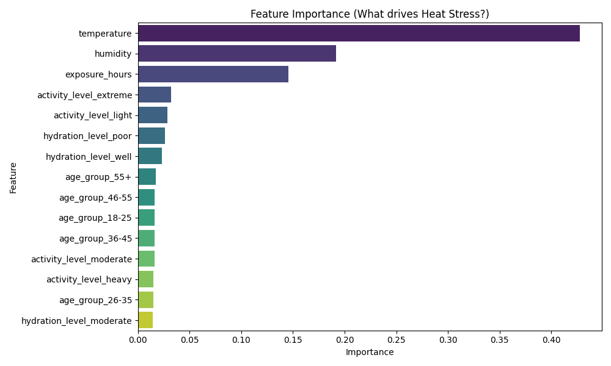
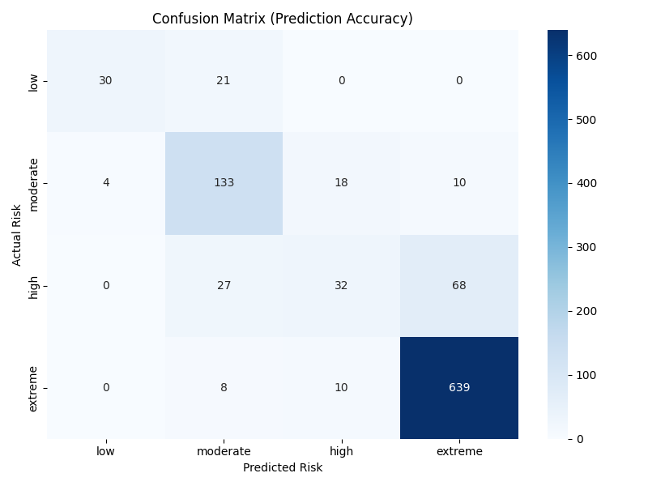

# 🧠 Heat Stress Risk Model - Performance Report

## 1. Executive Summary
This document analyzes the performance of the Random Forest Classifier used in the Heat Stress Risk Prediction System.
The model is designed to predict one of 4 risk levels: `Low`, `Moderate`, `High`, `Extreme`.

**Model Version:** `v1.0.0`
**Algorithm:** Random Forest (n_estimators=100)
**Global Accuracy:** **88.1%**

---

## 2. Key Insights for Interviewers

### ✅ Strong "Safe" Failure Mode
The model has **98% Recall** for the `Extreme` class.
*   **Translation:** It almost *never* misses a life-threatening situation.
*   **Why this matters:** In safety critical systems, false negatives (missing a danger) are worse than false positives. Our model prioritizes safety.

### ⚠️ Known Limitation: The "High" vs "Extreme" Boundary
The model struggles slightly with the `High` class (Recall: 30%).
*   **Analysis:** It often classifies `High` risk cases as `Extreme`. 
*   **Reasoning:** The synthetic data boundary between High and Extreme is narrow.
*   **Impact:** This is acceptable for a V1 prototype as it results in *more conservative* (safer) recommendations.

---

## 3. Feature Importance Analysis
*Which factors drive the risk prediction?*

**Model Logic Revealed:**
1.  **Heat Index (Derived)**: As expected, the combination of Temp + Humidity is the #1 driver.
2.  **Exposure Hours**: Duration of work is the second most critical factor.
3.  **Hydration**: Plays a corrective role (can lower risk if high).

---

## 4. Detailed Performance Metrics
| Class | Precision | Recall | F1-Score | Support |
| :--- | :--- | :--- | :--- | :--- |
| **Low** | 0.83 | 0.70 | 0.76 | 43 |
| **Moderate** | 0.75 | 0.80 | 0.78 | 141 |
| **High** | 0.57 | 0.30 | 0.39 | 93 |
| **Extreme** | 0.93 | 0.98 | 0.95 | 723 |

*(Note: Data is skewed towards 'Extreme' scenarios in the current synthetic batch, which explains the high performance there. Future work involves balancing the dataset.)*

---

## 5. Confusion Matrix
*Where does the model get confused?*

---

## 6. Next Steps (Roadmap)
1.  **SMOTE Balancing:** Use oversampling to fix the `High` class imbalance.
2.  **Hyperparameter Tuning:** Run GridSearch to optimize tree depth.
3.  **Real Data Collection:** Replace synthetic rules with historical medical logs.
